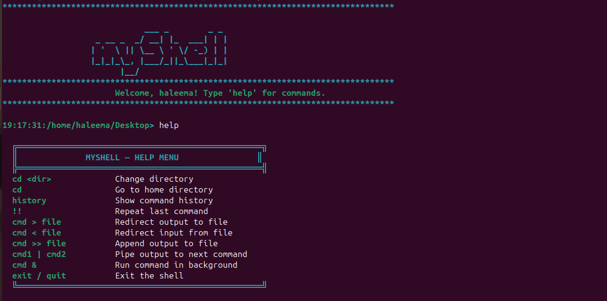

# MyShell

> A custom Unix shell built from scratch in C — featuring piping, I/O redirection, background execution, timestamped prompts, and command history.

---
## Banner

---
## Features

| Feature | Description |
|---|---|
| Command Execution | Runs standard Unix commands via `fork()`, `execvp()`, `wait()` |
| Piping | Single-pipe support using `\|` between two commands |
| Output Redirection | Write to file with `>`, append with `>>` |
| Input Redirection | Read from file with `<` |
| Background Execution | Run processes in background with `&`, prints child PID |
| Command History | Stores last 10 commands in a circular buffer |
| `!!` Repeat | Re-executes the most recent command |
| Built-in `cd` | Changes directory; `cd` alone goes to `$HOME` |
| Built-in `help` | Displays formatted help menu in terminal |
| Built-in `exit` / `quit` | Exits the shell gracefully |
| Timestamped Prompt | Prompt shows current time (`HH:MM:SS`) and working directory |
| Colored Output | ANSI color codes for prompt, errors, history, and banner |

---

## Project Structure

```
MyShell/
└── myshell.c       # Single-file implementation
```

All logic is contained in one file, organized into the following sections:

- `show_banner()` — Prints the ASCII art banner and welcome message on startup
- `get_prompt()` — Builds the timestamped `HH:MM:SS:/current/path>` prompt string
- `save_to_history()` / `show_history()` / `get_last_command()` — History management (circular buffer, max 10)
- `strip_newline()` — Removes trailing newline from `fgets()` input
- `parse_args()` — Tokenizes input string, detects `&` for background mode
- `cmd_cd()` / `cmd_help()` / `cmd_exit()` — Built-in command handlers
- `setup_redirection()` — Handles `>`, `>>`, `<` by reassigning file descriptors via `dup2()`
- `run_piped_commands()` — Splits input on `|`, forks two children, connects via `pipe()` + `dup2()`
- `execute_command()` — Central dispatcher: resolves built-ins, pipes, and external commands
- `main()` — Shell loop: read → strip → history → execute

---

## Tech Stack

| Component | Detail |
|---|---|
| Language | C (C99) |
| System Calls | `fork`, `execvp`, `wait`, `pipe`, `dup2`, `open`, `getcwd`, `chdir` |
| Platform | Unix / Linux |
| Build Tool | GCC / Makefile |

---

## Getting Started

### Prerequisites

- GCC compiler
- Unix/Linux environment (tested on Ubuntu)

### Compile

```bash
gcc -o myshell myshell.c
```

### Run

```bash
./myshell
```

---

## Usage Examples

```bash
# Basic command
14:32:07:/home/haleema> ls -la

# Pipe
14:32:10:/home/haleema> ls | grep .c

# Output redirection
14:32:15:/home/haleema> ls > output.txt

# Append redirection
14:32:20:/home/haleema> echo "log" >> output.txt

# Input redirection
14:32:25:/home/haleema> sort < input.txt

# Background execution
14:32:30:/home/haleema> sleep 10 &
  [Background PID: 4821]

# Repeat last command
14:32:35:/home/haleema> !!
  Repeating: sleep 10 &

# View history
14:32:40:/home/haleema> history
  ── Command History ──
  [1] ls -la
  [2] ls | grep .c
  [3] sort < input.txt

# Change directory
14:32:45:/home/haleema> cd Documents

# Help menu
14:32:50:/home/haleema> help
```

---

## Implementation Notes

- History ignores empty input and `!!` itself to avoid redundant entries
- Background processes are not waited on; the shell continues immediately and prints the child PID
- Redirection is handled inside the child process after `fork()`, before `execvp()`, so the parent's file descriptors are never affected
- Pipe implementation forks two children: left child writes to `pipe_fd[1]`, right child reads from `pipe_fd[0]`; parent closes both ends and waits on both PIDs
- The prompt buffer is `static` inside `get_prompt()` — safe because it is used immediately after the call and never concurrently
- `parse_args()` uses `strtok()` which modifies the input string in place; callers always pass a copy

---

## Known Limitations

- Only a single pipe (`cmd1 | cmd2`) is supported; chained pipes (`cmd1 | cmd2 | cmd3`) are not handled
- Only one redirection operator per command is supported
- No support for quoted arguments (e.g. `echo "hello world"` will not work as expected)
- Background processes are not reaped; zombie processes may accumulate in long sessions

---

## Author

**Haleema Abid**
BS Cybersecurity — Air University Kamra Campus
[Portfolio](https://0xhaleema.github.io) · [GitHub](https://github.com/0xhaleema)

---

## License

This project is developed for academic purposes.
